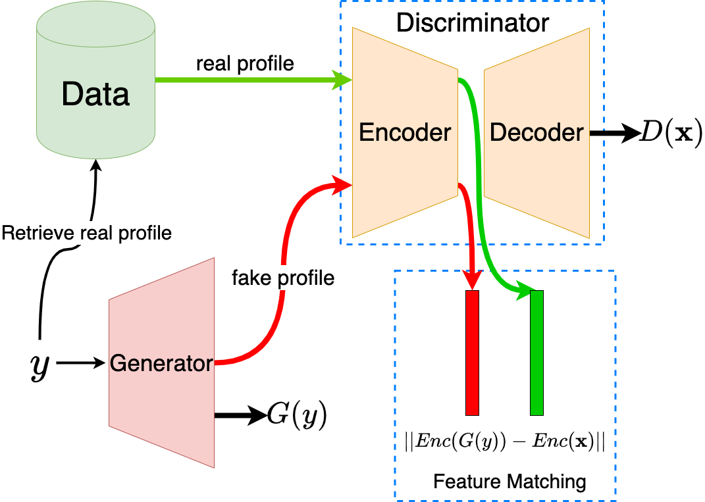

# GAN-based Matrix Factorization for Recommender Systems



This repository contains the datasets' splits, the source code of the experiments and their results for the paper **"GAN-based Matrix Factorization for Recommender Systems" accepted at the 37th ACM/SIGAPP Symposium on Applied Computing (SAC '22)**.

**Paper**: https://dl.acm.org/doi/10.1145/3477314.3507099

**arXiv**: https://arxiv.org/abs/2201.08042

**Video-presentation**: https://www.youtube.com/watch?v=4t22QbJZmzA

## How to use this repo
This repo is based on a version of [Recsys_Course_AT_PoliMi](https://github.com/MaurizioFD/RecSys_Course_AT_PoliMi). In order to run the code and experiments you need first to setup a Python environment. Any environment manager will work, but we suggest `conda` since it is easier to recreate our environment if using a GPU. `conda` can help with the installation of `CUDA` and `CUDA toolkit` necessary to utilize available GPU(s). We highly recommend running this repo with a GPU since GAN-based
recommenders require long training times.

### Conda
Run the following command to create a new environment with `Python 3.6.8` and install all requirements in file
`conda_requirements.txt`:

```shell
conda create -n <name-env> python==3.6.8 --file conda_requirements.txt
```

The file `conda_requirements.txt` also contains the packages `cudatoolkit==9.0` and `cudnn==7.1.2` which are installed completely separate from other versions you might already have installed and are managed by `conda`.

Install the following packages using `pip` inside the newly created environment since they are not found in the `main` channel of `conda` and `conda-forge` channel holds old versions of them:

```shell
pip install scikit-optimize==0.7.2 telegram-send==0.25
```

Activate the newly created environment:

```shell
conda activate <name-env>
```

### Virtualenv & Pip
First download and install Python 3.6.8 from [python.org](python.org). Then install `virtualenv`:

```shell
python -m pip install --user virtualenv
```

Now create a new environment with virtualenv (by default it will use the Python version it was installed with):

```shell
virtualenv <name-env> <path-to-new-env>
```

Activate the new environment with:

```shell
source <path-to-new-env>/bin/activate
```

Install the required packages through the file `pip_requirements.txt`:

```shell
pip install -r pip_requirements.txt
```

Note that if you intend to use a GPU and install required packages using `virtualenv` and `pip` then you need to install separately `cudatoolkit==9.0` and `cudnn==7.1.2` following instructions for your GPU on [nvidia.com](nvidia.com).

Before running any experiment or algorithm you need to compile the Cython code part of some of the recommenders. You can compile them all with the following command:

```shell
python run_compile_all_cython.py
```

*N.B* You need to have the following packages installed before compiling: `gcc` and `python3-dev`.

*N.B* Since the experiments can take a long time, the code notifies you on your Telegram account when the experiments start/end. Either configure `telegram-send` as indicated on [https://pypi.org/project/telegram-send/#installation](https://pypi.org/project/telegram-send/#installation) or delete the lines containing `telegram-send` inside `RecSysExp.py`.

<br>

# Running experiments
All results presented in the paper are already provided in this repository. In case you want to re-run the experiments, below you can find the steps for each one of them.

## Comparison with baselines[^credits]
In order to run all the comparisons with the baselines use the file `RecSysExp.py`. First compute for each dataset the 5 mutually exclusive sets:

* Training set: once best hyperparameters of the recommender are found, it will be finally trained with this set.

  * Training set small: the recommender is first trained on this small training set with the aim of finding the best hyperparameters.
  * Early stopping set: validation set used to incorporate early stopping in the hyperparameters tuning.
  * Validation set: the recommender with the current hyperparameter values is tested against this set.
* Test set: once the best hyperparameters are found, the recommender is finally tested with this set. The results presented are the ones on this set.

Compute the splits for each dataset with the following command:

```shell
python RecSysExp.py --build-dataset <dataset-name>
```

To run the tuning of a recommender use the following command:

```shell
python RecSysExp.py <dataset-name> <recommender-name> [--user | --item] [<similarity-type>] 
```

* `dataset-name` is a value among: `1M, hetrec2011, LastFM`.
* `recommender-name` is a value among: `TopPop, PureSVD, ALS, SLIMBPR, ItemKNN, P3Alpha, CAAE, CFGAN, GANMF`.
* `--user` or `--item` is a flag used only for GAN-based recommenders. It denotes the user/item-based training procedure for the selected recommender.
* `similarity-type` is a value among: `cosine, jaccard, tversky, dice, euclidean, asymmetric`. It is used only for ItemKNN recommender.

All results, best hyperparameters and dataset splits are saved in the `experiments` directory.

---

## Testing on test set with best hyperparameters
In order to test each tuned recommender on the test set (which is created when tuning the hyperparameters) run the following command:

```shell
python RunBestParameters.py <dataset-name> <recommender-name> [--user | --item] [<similarity-type>] [--force] [--bp <best-params-dir>]
```

* `dataset-name` is a value among: `1M, hetrec2011, LastFM`.
* `recommender-name` is a value among: `TopPop, PureSVD, ALS, SLIMBPR, ItemKNN, P3Alpha, CAAE, CFGAN, GANMF`.
* `--user` or `--item` is a flag used only for GAN-based recommenders. It denotes the user/item based training procedure for the selected recommender.
* `similarity-type` is a value among: `cosine, jaccard, tversky, dice, euclidean, asymmetric`. It is used only for ItemKNN recommender.
* `--force` is a flag that forces the computation of the results on test set. By default, if the result for the tuple (dataset, recommender) exists in `test_result` directory, the computation is not performed.
* `--bp <best-params-dir>` sets the directory where the best parameters (`best_params.pkl`) are located for this combination of
(dataset, recommender), by default in `experiments` directory.

The results are saved in the `test_results` directory.

---

## Ablation study
To run the ablation study, use the script `AblationStudy.py` as follows:

```shell
python AblationStudy.py <dataset-name> [binGANMF | feature-matching [--user | --item]]
```

* `dataset-name` is a value among: `1M, hetrec2011, LastFM`.
* `binGANMF` runs the first ablation study, the GANMF model with binary classifier discrimnator. This tunes the recommender with `RecSysExp.py` and then evaluates it with `RunBestParameters.py` on the test set.
* `--user` or `--item` is a flag that sets the training procedure for `binGANMF` recommender.
* `feature-matching` runs the second ablation study, the effect of the feature matching loss and the user-user similarity heatmaps. The results are saved in the `feature_matching` directory.

---

## MF model of GANMF
To run the qualitative study on the MF learned by GANMF, use the script `MFLearned.py` as follows:

```shell
python MFLearned.py
```

It executes both experiments and the results are saved in the `latent_factors` directory.


[^credits]: For the baselines `Top Popular`, `PureSVD`, `ALS`, `SLIMBPR`, `ItemKNN`, `P3Alpha` and model evaluation we have used implementations from [Recsys_Course_AT_PoliMi](https://github.com/MaurizioFD/RecSys_Course_AT_PoliMi).
